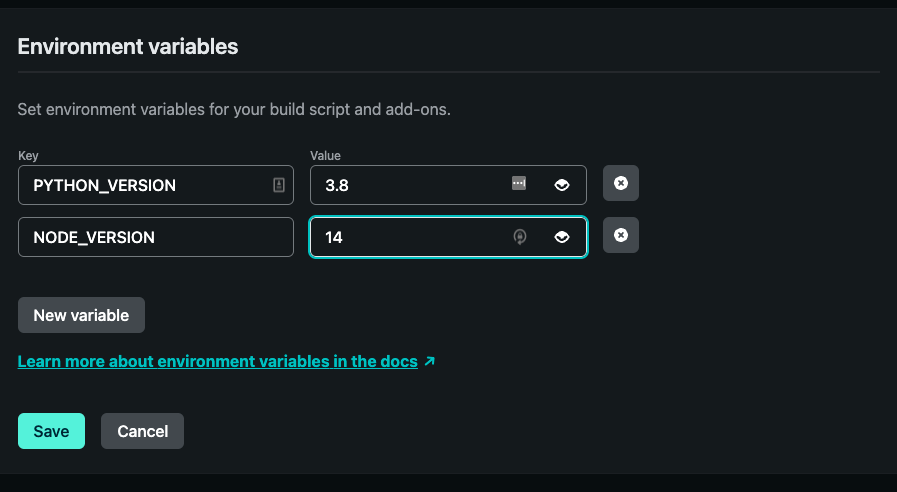

# Applied Reinforcement Learning with RLlib

A course for RL beginners, using RLlib.

This project uses `python` to parse notebooks into a specific folder structure of markdown
files that are subsequently read by a `node` project to serve the course material.
The course platform is built with the [spacy course framework](https://github.com/explosion/spacy-course)
and is based on Gatsby as web framework, plyr for videos, and revealjs for slides. 

## Build the site

Create a new Python virtual environment and install all dependencies:

```shell
virtualenv venv && source venv/bin/activate
pip install -r requirements.txt
```

Next, run the `parse_notebooks.py` script to generate all course `chapters`, including
contained `slides`, `static` resources, and `exercises` - all from the jupyter notebooks
you put into `notebooks`.
We recommend using Python 3.8, as this is what's used in deployment as well.
In short, simply run

```shell
python parse_notebooks.py
```

Once the course content is ready, you can move on to the `node` side of things.
Make sure to have at least Node version 10 installed.
We recommend using `nvm` and installing the Node version we use in deployment by typing

```shell
nvm install v14.17.3
```

but other node version should work as well (not tested), and you also don't have to use `nvm`.
To install all dependencies needed for this project, please run

```shell
npm install -g gatsby-cli
npm install
```

Then to test the course locally on [http://localhost:8080](http://localhost:8080), you
can run a hot-reloading development server with

```shell
npm run dev
```

Note that any code changes you do in `src` will immediately be reflected by Gatsby, but
if you change any of your notebooks, you have to rebuild sources with `python parse_notebooks.py`
(which does not require to restart `npm run dev`).

## Deployment on Netlify

Connect Netlify to the GitHub remote of this project,
then set `NODE_VERSION` to `14` and `PYTHON_VERSION` to `3.8` as shown below,
and then deploy.


